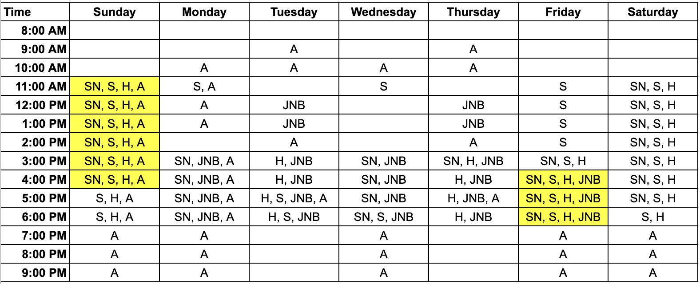
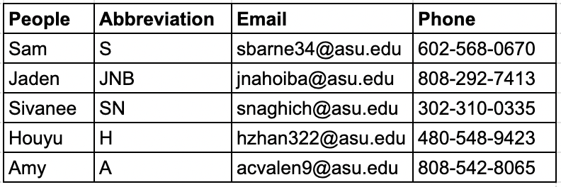

**Team Goals**
---
The goals this team would like to accomplish are as follows: to create a
product that is original yet innovative; the product fulfills an actual
need; the group learns and grows during this class; the product is
operable in a safe and user-friendly manner; and the product meets the
project requirements while staying within the development budget.

**Product Mission Statement**
---
To produce a cost-effective product showcasing at least two different
environmental serial sensors to benefit the consumer.

**Communication Channels**
---
*Table 1: Team Member Communication Modes*

| **Name**        | **1st Form of   | **2nd Form of    | **3rd Form of    |
|                 | Communication** | Communication**  | Communication**  |
|-----------------|-----------------|------------------|------------------|
| Samuel Barnett  | Phone:          | Discord:         | Email:           |
|                 | 602-568-0670    | Axolotl_Cactus   | sbarne34@asu.edu |                |
|-----------------|-----------------|------------------|------------------|
| Jaden           | Phone:          | Email:           | Discord:         |
| Nahoi-Baricar   | 808-292-7413    | jnahoiba@asu.edu | jaden_nahoi      |
|-----------------|-----------------|------------------|------------------|
| Sivanee         | Phone:          | Messenger        | Discord:         |
| Naghichetty     | 302-310-0335    |                  | sivanee          |
| Premkumar       |                 |                  |                  |
|-----------------|-----------------|------------------|------------------|
| Houyu Zhang     | Phone:          | Email:           | Discord:         |
|                 | 480-548-9423    | hzhan322@asu.edu | alpaca_z         |
|-----------------|-----------------|------------------|------------------|
| Amy Valencia    | Phone:          | Discord:         | Email:           |
|                 | 808-542-8065    | Amyjcv           | acvalen9@asu.edu |                |
|-----------------|-----------------|------------------|------------------|

**Communication Procedures**
---
> All communication will be done over the phone. It will either be
> through phone call, text message, in a group chat, and/or email. Our
> second form of communication will be done via discord where all
> members will have access to a discord channel that can also help as
> another form of group chat communication. The team will discuss
> project ideas, upcoming assignments/checkoffs, any info that has not
> been passed down due to a team member\'s absence, etc.

**Meeting Schedule**
---
*Table 2: Meeting times acceptable for each group member, yellow blocks
display days & times that work for the majority of group members.*

{width="6.5in"
height="2.638888888888889in"}

*Table 3: List of names, abbreviations used in Table 1 above, email, and
phone.*

{width="3.8593755468066493in"
height="1.2831681977252842in"}

**Meeting Coordination**
---
1.  To remind the group about any upcoming due dates, our project monitor will send out a group message a week before the submission and also add things to a shared calendar.

2.  We will decide on the meetings a week before and schedule them beforehand.

3.  The group will meet virtually most of the time that is spent outside of class. However, if an in-person meeting is necessary, it will be discussed amongst the group.

4.  If a team member has something that they need to attend to or needs to take care of something outside of project work, team meetings,etc. They must come forth ahead of time and must let the group know as soon as possible.

**Roles & Responsibilities**
---
  -----------------------------------------------------------------------
  **Person**                          **Role**
  ----------------------------------- -----------------------------------
 
  Sam -                                 Project monitor

  Jaden -                               Meeting Leader

  Sivanee -                            Meeting recorder

  Houyu -                               Assignment leader

  Amy -                                 Assignment editor/finalizer
  
  -----------------------------------------------------------------------

-   Each member will pick a role based on the amount of workload that they can tackle. If a team member feels like they need assistance on a specific project assignment/checkpoint, they will communicate with the rest of the team and they will do their best to assist in any way that they can. In order for the group to succeed as a whole, we must all be doing our parts and contributing to the team. In addition, the team will check-in with one another to make sure that we are all doing the work evenly and effectively. The team will refer to team assignments, documentations, contracts, etc in order for the team to reach its milestones and succeed as a whole.

-   If a change in roles and responsibilities is necessary, the team will discuss the situation and decide on who would be a better fit for the role

-   Each team member will choose their own technical responsibilities based on how much workload they can put out. If a team member feels like they need assistance with a particular task, they will reach out to the rest of the group so that the group can succeed as a whole and that everyone is on the same page.

**Team Coordination & Accountability**
---
-   Each and every assignment will undergo a review process with the team as a whole. The group will decide whether or not an assignment is complete and is ready for submission. If a team member objects to an assignment submission, it will go through a review process that breaks down the assignment by every detail, making sure that it is complete and ready to be submitted.

-   Skill and knowledge of an assignment will be verbally distributed either in-person or remotely. If a team member feels that they don't have the skill and knowledge to complete a task, the team will comprise the workload in order to complete the assignment by the assigned deadline.

-   Any feedback that is presented to the group will be distributed to every team member to ensure that the entire team is on the same page. If a team member is absent either in class or during a meeting time, information will be passed down to that individual.

**Conflict Recognition & Resolution**
---
-   Any conflicts within the group will be tackled on as a grouptogether. If a team member has any sort of conflict with the group, they will voice out their thoughts and concerns to the group and present what needs to be fixed. Therefore, the group will come to a compromise as a whole either in-person or remotely via one of the communication methods that has been established.

[Back to Home](index)
