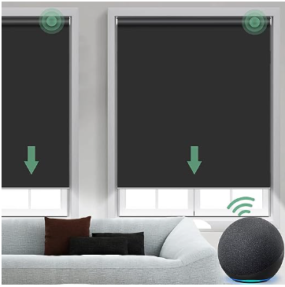
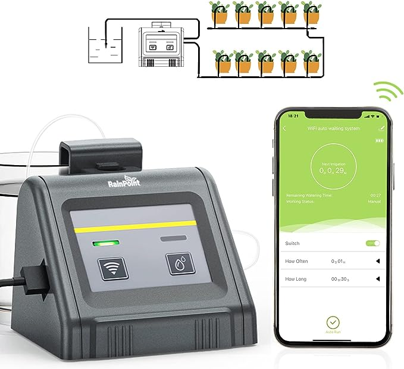
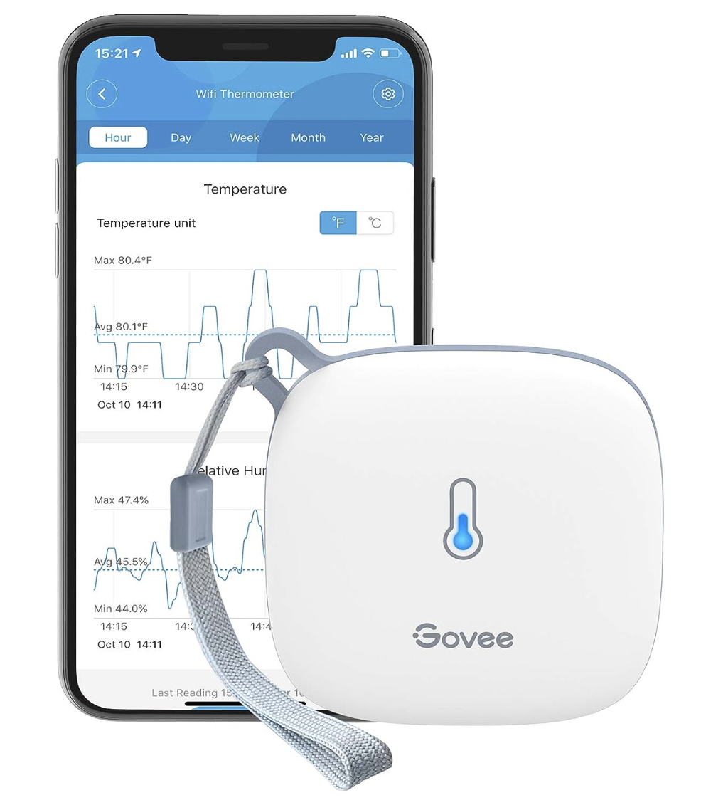
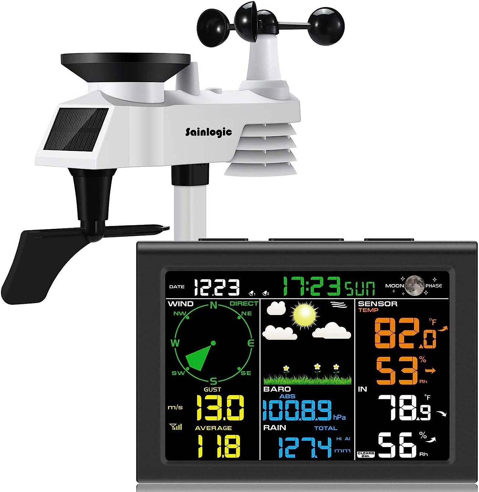
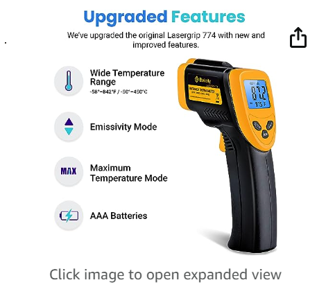
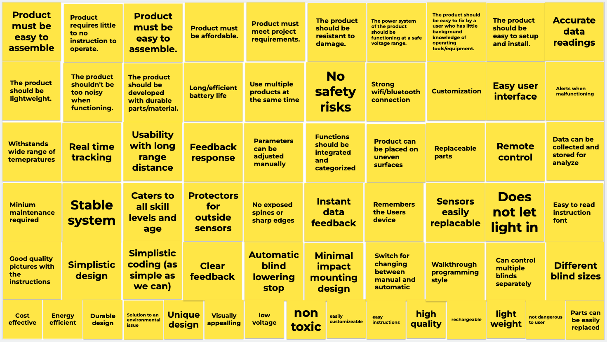
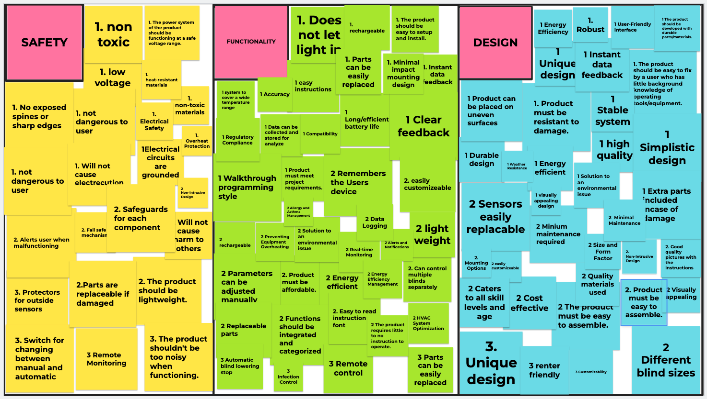

**User Needs, Benchmarking and Requirements**

Team 301

**[Existing Commercial Products]**

**Search #1**

**Keywords:** Remote Controlled Window Shade

**Search Results Link:**
[[Link]](https://www.amazon.com/Yoolax-Motorized-Compatible-Motorize-Vinyl-Dark/dp/B07GNZ2TYR/ref=sr_1_1_sspa?crid=23NQ9TRMMSTPA&keywords=remote%2Bcontrolled%2Bwindow%2Bshades&qid=1693081238&sprefix=remote%2Bcontrolled%2Bwindo%2Caps%2C146&sr=8-1-spons&ufe=app_do%3Aamzn1.fos.f5122f16-c3e8-4386-bf32-63e904010ad0&sp_csd=d2lkZ2V0TmFtZT1zcF9hdGY&th=1)

**Selected Product**

1.  [Yoolax Motorized Blind Shade for Window with RemoteControl]

  
Price: \$139.00

Vendor: Yoolax

Description:

Motorized Blackout Window Shades is customized, please find the
\"Customize Now\" button on the top right. Then, follow its guidance to
customize your blinds. We\'ll email each customer for customized
information and double check in 24 hours. Please pay attention to our
message that arrives the next day after your order! Any special inquiry
you can contact us via Amazon message. Z425 smart battery motor can be
directly compatible with 5 Versions of Alexa. (Echo Plus 2nd Gen, Echo
Show 2nd Gen, Echo Studio, Echo Show 10, Echo 4th Gen). No Smart Bridge
needed. YL23 Bluetooth motor can directly work with Yoolax Home App
without Smart Bridge. Connection with all versions of Alexa & Google
Home requires a Bluetooth hub (available at Yoolax Store). Apple Homekit
Motor can directly work with apple devices.

Positive Comments

| Consumer Voice                    | Restated Customer Need            |
------------------------------------|-----------------------------------|
| - “We bought this custom shade because during the summer, the heat and light coming through this very tall arched window in our foyer was unbearable. Our upstairs landing was staying very hot all day. This has been perfect so far. The temperature difference in our house has changed drastically. This color is Jacquard Coffee and we have cream trim on all our moldings and it goes perfectly. The other side that faces the outside is white.”    - "So easy to install and it works great. Consumer service contacted me within 24 hours when I had a question.”   - “Really nice blinds. Install was really simple and they look great installed. I will say the motor is a bit loud, but it is not unreasonable and I don't think it's a big deal. Shipping was unbelievably fast.” | -Product came with all features. (explicit)   - Product installation catered to customer’s installation ability. (explicit)   - Product came with all features. (explicit)   - Product is visually appealing (explicit)   - Customer service is quick and helpful (latent)   - Overall pleasant experience handling and setting up device (latent) |

Negative Comments

| Consumer Voice                   | Restated Customer Need            |
|----------------------------------|-----------------------------------|
| - “They look quite fragile and much less appealing than in the product picture on Amazon web page. Blinds came without any installation instructions. If, like I did, installed the blinds inside the window frame - removing them is super difficult. One of the USB cables (1 out of 5) was damaged and cant be used.”   - “Connecting the hub to our 2.4/5G network was super difficult. Device can't connect to combined 2.4/5G Wifi, rather it needs a dedicated 2.4G network. After several hours configuring my WiFi, I got the hub connected. But that turned out to be a waste of time. The app is done for old iOS devices. App itself doesn't add any value to the standard remote we ordered as well. Mechanically the WiFi hub feels like a 99 cent cheap piece of plastic and is ugly.”   - “Don't let the customizable ordering fool you into believing you're paying for quality. The blinds will arrive and be impossible to program into alexa or their app. The instructions are unclear.” | - Product did not cater to customers'technological compatibility (explicit)   - Product is robust and visually appealing (explicit)   - App used for remote access is useful and user friendly (explicit)   - Clear and easy to follow instructions(explicit) |

**Search #2**

**Keywords: automatic plant waterer indoor**

**Search Results Link:
[[Link]](https://www.amazon.com/RAINPOINT-Automatic-Watering-Irrigation-Self-Watering/dp/B09GYDBC7Y/ref=sxin_16_pa_sp_search_thematic_sspa?content-id=amzn1.sym.1c86ab1a-a73c-4131-85f1-15bd92ae152d%3Aamzn1.sym.1c86ab1a-a73c-4131-85f1-15bd92ae152d&crid=CZXLO534LZDM&cv_ct_cx=automatic%2Bplant%2Bwaterer%2Bindoor&keywords=automatic%2Bplant%2Bwaterer%2Bindoor&pd_rd_i=B09GYDBC7Y&pd_rd_r=acb6824d-8ffe-43ed-a98f-d0b5684e5d82&pd_rd_w=wgMVH&pd_rd_wg=imqvY&pf_rd_p=1c86ab1a-a73c-4131-85f1-15bd92ae152d&pf_rd_r=NFA941VP5AFZ2R4F4DJA&qid=1693089031&sbo=RZvfv%2F%2FHxDF%2BO5021pAnSA%3D%3D&sprefix=automatic%2Bplant%2Bwaterer%2B%2Caps%2C127&sr=1-1-364cf978-ce2a-480a-9bb0-bdb96faa0f61-spons&ufe=app_do%3Aamzn1.fos.006c50ae-5d4c-4777-9bc0-4513d670b6bc&sp_csd=d2lkZ2V0TmFtZT1zcF9zZWFyY2hfdGhlbWF0aWM&th=1)**

**Selected Product**

2.  [RAINPOINT WiFi Automatic Watering System For Indoor Potted Plants]

  

Price: \$54.99

Vendor: Rainpoint

Description:

RAINPOINT WiFi automatic watering system for potted plants, like any
other Wi-Fi device: Once you paired the device with WIFI, you can
connect to your watering system from anywhere, and remotely manage
multi-schedules to prevent watering-off or overwatering.

Positive Comments

| Consumer Voice                    | Restated Customer Need            |
|-----------------------------------|-----------------------------------|
| - “Note that Manual operation time is controlled by the "How Long" setting in Program operation. If you need to run the pump for less time than this setting, you tap the pump button to start it, and tap again when you want it to stop. If you try to run it longer than the Program operation setting, it will shut off after the Programmed operation's setting, and you will have to tap it again to resume pumping.”   - I could either set it and forget it with a predefined schedule, or monitor it remotely, even triggering extra watering on demand if needed. Powered by USB and/or Batteries (to address power outages), the system will automatically switch to the appropriate power source.”   - “Very easy to set up. I initially had an issue (my fault completely) and had to contact customer service. They got me up and running very quickly. Make my life so much easier because I cannot remember to water my house plants. That are all thriving due to this machine.” | - Intuitive and simplistic user interface on app(explicit)   - The ability to remotely monitor the product (explicit)   - Easy set up - though had to get assistance (explicit) | 

Negative Comments

| Consumer Voice                   | Restated Customer Need            |
|----------------------------------|-----------------------------------|
| - “I set it for 5 min every 24 hours and woke up and it dumped 13 gallons of water into my three plants in my grow tent. Let's just say I wasn’t expecting this. When the pump shuts off it continues to pull water and doesn’t stop this is after a lot of testing there is no automatic shut off valve to stop the flow once the pump starts it”   - “The app has step-by-step instructions on how to set up the WiFi connection, but they are difficult to understand. It is not clear if batteries need to be installed or not, or if it will work either way. The instructions are written in an illogical way. I had to make 4 attempts at pairing the unit before it finally succeeded, and I have no idea why it finally succeeded, especially since it did not switch between rapid and slow blinks, as the instructions stated it would. During some of the attempts it had asked me to pair my phone to a "smart..." WiFi network, which I never saw, while during the final attempt it did not ask me to do this.”   - “The single-color left LED can communicate 5 different messages, depending on how it blinks. This makes for a very cryptic user interface, especially since there is not even a blink guide next to the LED. There really should be a separate LED for battery status.” | - Clear and concise user interface (explicit)   - Clear setup instructions with high quality visual aids (explicit)   - Status lights are easy to interpret (explicit)   - Ease of use (latent) | 

**Search #3**

**Keywords: Humidity and temperature sensor**

**Search Results Link:
[[Link]](https://www.amazon.com/Govee-Indoor-Temperature-Humidity-Sensor/dp/B0872ZWV8X/ref=sr_1_1_sspa?crid=1EUHWY8LOND28&keywords=Govee%2BWiFi%2BThermometer%2BHygrometer%2BH5179&qid=1693165539&sprefix=govee%2Bwifi%2Bthermometer%2Bhygrometer%2Bh5179%2Caps%2C157&sr=8-1-spons&sp_csd=d2lkZ2V0TmFtZT1zcF9hdGY&th=1)**

**Selected Product**

3.  [Govee WiFi Thermometer Hygrometer]

 

Price: \$39.99

Vendor: Amazon

Description: Easily monitor temperature and humidity data in real time
through Smart WiFi control via Govee Home app. Thermometer provides
reading to +-0.54F and humidity to +-3%RH. Easily set-up ranges and can
send notifications when levels are out of range.

Positive Comments

| Consumer Voice                    | Restated Customer Need            |
|-----------------------------------|-----------------------------------|
| - "“It’s accurate first of all. Used it in two different humidors with its own hygrometer and readings are always on point. Love that I can see what the humidity reading is on my phone so I don’t have to always check my humidors.” | - Accurate readings (latent)   - Easily accessible using phone app (latent)   - Ability to look at more than one device at a time (explicit) |
| - “I’ve only had these up for a week. I got two of them to monitor temperature in two separate work locations in two different cities. Super easy to set up and so far work great. I exported data to Excel with no issues. Real quick and easy to do so. I use alerts too and they alert me every time the temperature reaches a specific level.” | - Easy set up (explicit)   - Ability to export data into Excel (explicit)   - Monitor multiple devices in multiple locations through app (explicit) |
| - “I liked it so much I bought another one so that I could get data on both rooms individually. BTW, I was curious to see how closely the 2 of them matched when sitting side by side for a day - temperature varied at most .1 to .2 degree, humidity .1 to .2 percent.. I’m very pleased. I ran the 1st one for 2 months at the 10 minute upload interval for highest accuracy and the 1.5V alkaline batteries had only dropped to 1.47V when I got back. So battery performance is good too - I’ve now configured both units to upload at 30 minute intervals simultaneously and I’m guessing batteries will go at least a year.” | - Long battery life (latent)   - Accurate data readings (explicit)   - Ability to specify upload intervals (explicit) | 

Negative Comments

| Consumer Voice                   | Restated Customer Need            |
|----------------------------------|-----------------------------------|
| - “ I have had 4 of these since late last year and all 4 are now garbage. I purchased them for my temp and permanent greenhouse, my dad’s greenhouse, and to monitor my indoor grow room. They work great for the first couple months, but much more than that they just start reading erratic temps, refuse to connect via Bluetooth or wifi, and corrode like crazy. Number 1 started throwing crazy temps and going off line while IN my house, where the temp never got above 80 and the humidity never got above 70%. Number 2 started reading 265° in my greenhouse, then dropped to 32°, then to 165° when I brought it inside to check and change the batteries. Number 3’s back panel melted even though the greenhouse never rose above 105, and number 4, in the pic, was wet inside and corroded even though the hatch was hatch side down on a metal grate with wide slats so that it would never be in standing water.” | - Product data stays accurate even with consistent use (latent)   - No safety risks (latent)   - Strong bluetooth and wifi connection (explicit) |
| - “I bought this to monitor the temp in my garage freezer. This thing is CONSTANTLY losing connection to the Wi-Fi. It should and does not give any kind of notification when the signal is lost. It also only gives one brief notification when the temp gets too high. IMO it should make my phone go nuts until I acknowledge the notification. Only one quick beep is useless if I am saying mowing the grass……..I called Govee today to see if there was some kind of update or something they could look at. The guy tells me it is not supposed to go in the freezer. WTH? That is what I bought it for. I remember searching for and buying it specifically for the freezer when I picked it up a couple of years ago. Ridiculous!!! I guess it is worthless and I will have to search for something else to buy.” | - Strong wifi connection(explicit)   - Consistent alerts when data is out of range (latent)   - Ability to withstand a wide range of temperatures(latent). |
| - “If you are buying this because you want temperature alerts while you are away, you will be disappointed! Do not buy! First of all, notifications only work on Bluetooth -- while you are at home with your device! So there is no way to receive notifications while you are away. You can check the temperature while you are away by opening the app on your phone, to see if the temperature is within your desired range. But this is not quick -- it takes 5-10 seconds for the app to update with the recent data from the device. Second, the device only sends alerts via app notification, not email or text. And you only get one notification when the temp drops out of the range you specify. There is no way to escalate based on the amount of time the device has been out of temperature range, or to set a more severe temperature threshold." | - Real time data tracking (explicit)   - Ability to send continuous alerts as numbers go out of range (latent)   - Ability to see real time updates on app even when far from home (latent) | 

**Search #4**

**Keywords: Wireless weather station with outdoor sensors**

**Search Results Link:
[[Link]](https://www.amazon.com/sainlogic-Wireless-Forecast-Temperature-Pressure/dp/B08G1FZZ5M/ref=sr_1_1_sspa?keywords=Wind%2BSensor&qid=1693169930&sr=8-1-spons&sp_csd=d2lkZ2V0TmFtZT1zcF9hdGY&th=1)**

**Selected Product**

4.  [Sainlogic internet wireless station remote monitoringsystem]

 

Price: $103.99

Vendor: Sainlogic

Description:

This station provides precise weather conditions at all times, at home
or garden. The LCD color display showcases a variety of information. The
outdoor sensor is wirelessly connected to the console and the console
enables a wide range of weather information to be accessed. The 5-in-1
outdoor sensor transmits current information about the indoor
temperature and humidity, outside temperature and humidity, wind speed
and direction. There is also a rain gauge, min/max recordings, wind
chill and dew point alarm (high & low), a weather forecast based on air
pressure, calendar and a display of the current moon phase. All this is
visible on the color display (base station), via the solar powered
transmitter.

Positive Comments

| Consumer Voice                    | Restated Customer Need            |
|-----------------------------------|-----------------------------------|
| - "Our unit is mounted just off the shoreline of Lake Ontario. It is exposed to severe weather and lots of variations of conditions. It has held up well and is extremely accurate. I did have an issue with the outdoor temperature and humidity not displaying on the screen. Customer service was very responsive with suggestions to resolve the issue.I have had spiders get in and spin webs on the rain collection arm."   - "I bought this weather station because I had a Bresser brand that gave me connection problems and I wanted another one with another frequency.Positive aspects: the connection works perfectly, the data seems reliable, it seems more resistant than the Bresser, the screen is more beautiful with colors and lighting and it can be connected to the current so as not to waste batteries.Negative aspects: in comparison, it lacks many functionalities, it has a record of maximums and minimums but only for 24 hours and it does not specify what time and day it occurred. In addition, it does not have a record to see the data of the last 24 hours, that is, it only gives you the data of the moment."   - "It will be delivered well packaged. The structure and installation are well described and easy to implement. The function meets our requirements. The screen is large and clear.What we can't predict is the durability of the outdoor unit. It's made of plastic. In our area (Andalusia/1000m) there is a lot of sun and strong wind." | - Data and parameters can be quickly fed back(explicit)   - Stable wireless connection(explicit)   - Rechargeable instead of disposable batteries(explicit)   - Displays need to be bright and durable(latent)   - Weather data can be stored(explicit)   - Instrument parameters can be adjusted manually(latent)   - Easy to assemble and operate(explicit) |

Negative Comments

| Consumer Voice                   | Restated Customer Need            |
|----------------------------------|-----------------------------------|
| - "The batteries in the outdoor unit will be very difficult to replace while on the roof. There is a small screw to remove that is almost guaranteed to fall down and roll off the roof, and then the batteries have to go up into the unit with the correct polarity, and you will have to lay under it looking up to see the installation direction. Battery replacement from the side would be a lot better. Amended to one star.   - "This weather station has pretty severe mounting limitations if you are mounting it on a "vertical" service. If this surface is vertical, you can only mount it on an east or west facing surface, as the mounting hardware included doesn't let you rotate the unit around to point the outdoor sensor in the correct direction."   - "It certainly has a lot of functions (mostly useless), and my estimate is around a hundred. To pull up all this information, you have basically three buttons located around the edges, so be careful if you have to pick it up to read it or shift the rain gage scale. If you push the wrong button or push them in the wrong sequence, you could wind up erasing data. No menu and no help from the manual." | - Internal parts are easy to replace(explicit)   - Large battery capacity(latent)   - The station can be mounted at any angle(explicit)   - The units can be rotated(explicit)   - All functions should be integrated and categorized(explicit)   - Wrong actions on system can be undone(explicit)   - The instruction is simple and easy to understand(latent)   - Longer life cycle(latent) |

**Search #5**

**Keywords: temperature sensor**

**Search Results Link:
[[link]](https://www.amazon.com/Etekcity-Thermometer-774-Temperature-Accessories/dp/B0B71HFH9K/ref=sr_1_5?crid=1PCQZNWIV0QA3&keywords=temperature%2Bsensor&qid=1693178443&sprefix=temperatue%3D%2Caps%2C220&sr=8-5&th=1)**

**Selected Product**

5.   

Price: $$16.99

Vendor: Amazon

Description:

Introducing the Etekcity Infrared Oven Thermometer Upgrade 774 in
vibrant yellow, offering precise temperature measurement from -58°F to
842°F. This versatile tool is essential for cooking, grilling, HVAC
diagnostics, and more, featuring a laser for accurate non-contact
readings. With its ergonomic design and intuitive interface, it\'s a
must-have companion for culinary and technical endeavors alike.

Positive Comments

| Consumer Voice                    | Restated Customer Need            |
|-----------------------------------|-----------------------------------|
| - "I initially got this for spot checking temperatures for my car engine during maintenance. My first use case was trying to pinpoint where the tiny water leak in my kitchen was coming from. The surrounding surface area was around 75 deg while the cold spot where the water was dripping was 67ish."   - "Other than that I've used it for checking BBQ grills, power plug temp, computer cpu cooler surface temp, LED light bulbs heat output, and a few other electronics."   - "I like that it has dual lasers, light weight, screen is easy to read and doesn't stay on for long. | - Product is light weight (explicit)   - Does not excessively drain battery (latent)   - Ability to use on a variety of surfaces (explicit)   - Device outputs accurate data (explicit)   - Product is easy to use (explicit) |

Negative Comments

| Consumer Voice                   | Restated Customer Need            |
|----------------------------------|-----------------------------------|
| - "“I thought this product was pretty good for the price until it was time to change the battery. It was very difficult to pry the 9 Volt battery off. The connections are just not made well and after finally getting it off and putting the new battery in, we’ll it’s just not working. It seemed to be a good product but unfortunately manufacturing did a poor job in designing the battery connection.”   - “Out of the box this item was reading 400+F after troubleshooting and reading all the manuals there is no way to calibrate it. Last time I used it it was 700+f.”   - “It seemed like a decent thermometer. But now it is too sticky to use.The coating (Thin rubberized soft feel grip) started becoming tacky in about 2 years of owning it. I hardly even used the thermometer. (Used it maybe 10 times) I tried wiping off the coating with goo gone and isopropyl alcohol. It’s too labor intensive to clean off.” | - Data outputs are consistent and accurate (latent)   - Well thought out design (latent)   - Ease of use (explicit)   - High quality materials used (latent)   - Durable and long lasting (latent) |

**User Needs**

1.  Product must be easy to assemble (explicit)

2.  Product requires little to no instruction to operate (explicit)

3.  Product is affordable (explicit)

4.  Product meets project requirements (latent)

5.  Product is resistant to damage (latent)

6.  Power system of the product should function at a safe voltage range explicit)

7.  Product requires little to no knowledge to operate (explicit)

8.  Product outputs accurate data readings (latent)

9.  Product is lightweight (explicit)

10. Product does not produce too much noise (explicit)

11. Product is made from durable materials (explicit)

12. Product has long/efficient battery life

13. Ability to connect two or more products together (explicit)

14. Product does not produce safety risks (latent)

15. Strong connection via wifi or bluetooth (explicit)

16. User is able to customize product (explicit)

17. Easy user interface (explicit)

18. Product is able to alert user when malfunctioning (latent)

19. Product is able to withstand a wide range of temperatures (latent)

20. Product is able to produce real time data (explicit)

21. Product can be used remotely (explicit)

22. Product parameters can be adjusted manually (explicit)

23. Functions should be integrated and categorized (explicit)

24. Product can be placed on uneven surfaces (explicit)

25. Parts are easily replaceable if damaged (latent)

26. Product can be controlled using a remote control (explicit)

27. Date can be collected and stored for analyzation (latent)

28. Minimum maintenance is needed to upkeep product (latent)

29. Product is stable (explicit)

30. Product caters to most ages and all skill levels (explicit)

31. Product is protected from environmental factors (latent)

32. There are no exposed spines or sharp edges (explicit)

33. Product is able to remember user's device (latent)

34. Sensors are easily replaceable (latent)

35. Product does what it's intended to do (explicit)

36. Instructions are easy to read and understand (explicit)

37. Product design is simplistic (explicit)

38. Safety precautions exist in case product fails (latent)

39. Minimal impact mounting design (latent)

40. Product has ability to switch from automatic to manual use(explicit)

41. Ability to control multiple products individually (explicit)

42. Product is cost effective (explicit)

43. Product is energy efficient (latent)

44. Product design is robust and durable (explicit)

45. Product solves an environmental issue (explicit)

46. Product is visually appealing (explicit)

47. Product is made from non-toxic materials (latent)

48. Product is rechargeable (latent)

49. Product engages with user (explicit)

50. Product is affordable (explicit)

51. Product can be used by everyone (explicit)

52. Product makes user's life easier (latent)

53. Product must withstand a high level of interaction (latent)

54. Product does not have a chance of injuring user or others around(latent)

55. Product is easy to program (explicit)

56. Product has a unique design (explicit)

57. Product does not distract other people (latent)

58. Product can be controlled outside bluetooth range (latent)

59. Product instructions come with easy to see pictures (explicit)

60. Multiple users are able to control one product (explicit)

 

*Figure 1: Initial Jamboard displaying all user needs.*

 

*Figure 2: Second Jamboard with user needs categorized by subject.*

  
*Figure 3: 3rd Jamboard with user needs
ranked on a scale of 1-3 within their meta needs.*

*Table 1: Rating final user needs using a 1-3 scale.*

| **User Needs (final consolidation) | **Reason | **Level of important 1-3 (3 is highest) |
|----------------------- | ----------------------- | ----------------------- | 
| **Safety:** Product is equipped with fail safe mechanisms such as alerts for each subsystem in the event of malfunction. | Product must ensure that users are not at risk during use. | 3 3 3 3 3        15/5 =      3 stars |
| **Functionality:** Product has the ability to set data ranges and is robust enough to withstand everyday use and handle changes in environment. | Product will serve its purpose on a daily basis so it needs to be able to withstand wear and tear. | 2 2 2 2 2      10/5 =   2 stars | 
| **Design:** Product is functional, easy to use and to troubleshoot, and performs as designed after continued use. | Product is intended to be fast and easy to set up. | 1 1 1 1 1      5 /5 =     1 star |

Team 301 ranked the Meta User Needs using a 1-3 star scale, with 3 being the most important. After calculations, Safety is Team 301’s most important Meta user need. While design and functionality are also important, our product needs to be safe for all users. Our product is designed to help users with a task and ensuring that there are no dangerous parts or mechanisms will ensure that it is safe for all to use. 

**User Needs Ranked Within Meta Needs**

1.  **Safety**

[1 Star]

-   Product is non toxic

-   Product must function at a safe voltage range

-   Product is made from heat resistant materials

-   There are no exposed spines or sharp edges

-   Product is not dangerous to the user

-   All electrical components are safe

-   All electrical circuits are grounded

-   Product is not a danger to user

-   Product is not a danger to itself

-   Product will not cause electrocution to users

-   Product will have overheating protection

> [2 Stars]{.underline}

-   Product will have safeguards for each component

-   Product will have a non intrusive design

-   Product will alert is there is a malfunction

-   Product should be lightweight

-   Parts will be replaceable if damaged

[3 Stars]

-   Product will be protected from weather changes

-   Product will not be too noisy or distracting

-   Product can be monitored from a safe distance

-   Product will have the ability to switch from automatic to manual

2.  **Functionality**

[1 Star]

-   Product does what it is intended to do

-   Product is rechargeable

-   Product will be easy to setup and install

-   Product system will cover a wide temperature range

-   Product will produce accurate data

-   Product parts can be easily replaced

-   Product will have instant data feedback

-   Product will have a long/efficient battery life

-   Product will be regulatory compliant

-   Data can be collected and stored for analyze

-   Compatibility

-   Clear feedback

-   Walkthrough programming style

-   Product must meet project requirements

> [2 Stars]{.underline}

-   easily customizeable

-   Remembers the Users device

-   Allergy and Asthma Management

-   Data Logging

-   light weight

-   Rechargeable

-   Preventing Equipment Overheating

-   Solution to an environmental issue

-   Real-time Monitoring

-   Alerts and Notifications

-   Parameters can be adjusted manually

-   Product must be affordable

-   Energy efficient

-   Energy Efficiency Management

-   Can control multiple blinds separately

-   Replaceable parts

-   Functions should be integrated and categorized

-   Easy to read instruction font

-   The product requires little to no instruction to operate

-   HVAC System Optimization

> [3 Stars]{.underline}

-   Automatic blind lowering stop

-   Infection Control

-   Remote control

-   Parts can be easily replaced

3.  **Design**

## Product Requirements Document

**Arizona State University**

**EGR 314: Embedded Systems Design II**

**Team 301**

Date of Creation: 8/27/23

Document Version 1.0

**Introduction**

The task that we have been given is to design and develop a product that
will involve systems that can respond to the environment by using serial
sensing and actuation in a system. The environmental data that the
product reads also needs to communicate to the internet over WiFi using
the MQTT protocol. In our product, we must also involve at least one
motor that will be controlled by a motor controller that communicates to
the I2C or SPI-based protocol.

**Objectives**

The goal that we want to achieve is to create a product that is highly
interactable for the user while also maintaining a user friendly
interface. We also want our product to be safe to handle.

**Stakeholders**

**Target group.** Upper-middle to high-class individuals between the age
of 25 - 50. They will be looking for the latest and upcoming gadgets.

**Target purchaser.** Homeowners, property owners/managers, or companies
who are interested in upgrading and modernizing their window shade
equipment.

**Customer Service.** Preferably easy-to-repair, components that can be
recycled and made from quality materials, and provide clear and quick
instructions.

**Retailers.** Prefers high quality products that can withstand a
variety of conditions - including everyday use, changes in temperature,
humidity, and pressure.

**Use Cases**

*User Story #1: Sierra*

Sierra is a 27 year old stay-at-home mom of three kids all under 7 years
old. During the day, the sun beams through the windows, making it
uncomfortably hot and disrupting nap time. Manual blinds and curtains
cause a safety risk as the kids like to pull on them and play with the
cords. Sierra recently purchased AutoShades for her kids' windows and
has programmed it to lower and pull-up during nap times and certain
temperatures. AutoShades has significantly decreased the temperature
levels in the kids' room and increased nap times.

The functionality of AutoShades has made Sierra buy the product for the
rest of the windows in her home. She is so pleased with the outcome that
she has started to tell her friends all about it.

*User Story #2: Keith*

Keith is the assistant to a CEO of a tech startup. He suggested
purchasing AutoShades for the office since the floor to ceiling windows
make it hard to work when the sun shines through. When the temperature
outside hits a certain point, all the shades will pull down. Thanks to
AutoShade, the office space is now glare free and employees are able to
focus more.

Customers visiting the company have noticed the new shades and are
impressed with the technology. Some are even thinking of letting their
employers know about the product.

**Aspects**

1.  **Hardware/ Product Design**

> 1.1 DC Motor, power source, soldering
>
> 1.2 Product should be unique and not sold in the market
>
> 1.3 Product should provide a solution to an environmental/weather
> issue
>
> 1.4 Product should be energy efficient
>
> 1.5 Product should be easy to use

2.  **Software/ Functionality**

> 2.1 Product should communicate data over WiFi
>
> 2.2 I2C or SPI
>
> 2.3 Product should use at least 2 environmental series sensors
>
> 2.4 Product should function in a variety of environments
>
> 2.5 Product should work as intended even after multiple uses

3.  **Interactivity & User Experience**

> 3.1 Product should be highly interactive for the user.
>
> 3.2 Product should maintain a user friendly interface
>
> 3.3 Product should have the ability to be checked remotely
>
> 3.4 Product should require minimal reading/ audio to understand
>
> 3.5 Product should engage user to continue using the product
>
> 3.6 Product should have feedback response that is easy to understand
>
> 3.7 Product should enhance, not detract from user experience

4.  **Customization**

4.1 Product should be a universal fit for multiple window shade sizes.

4.2 Product should be easy to assemble, with common tooling

4.3 Product should be tailored around customer needs

5.  **Manufacturing**

> 5.1 Product should be manufactured from quality materials
>
> 5.2 Product should come with extra parts in the case of damage
>
> 5.3 Product should be tested and approved by each team member before
> finalization
>
> 5.4 Product should have parts that are easily replaceable if damaged
>
> 5.5 Product should avoid the use of expensive materials
>
> 5.6 Product should include design files for easy repair

6.  **Safety**

6.1 Product should be safe to operate.

6.2 Product should not contain any sharp edges.

6.3 Product should be functioning at a safe/low voltage range.

6.4 Product motor(s) should not be too loud.

6.5 Product should be lightweight.

6.6 Product should be made from non-toxic materials

6.7 Product will not have any exposed wiring/electrical components

6.8 Product should not require tools that are dangerous or need extra
training to use

6.9 Product should not put user in any direct danger

6.10 Product should include safeguards in the event of malfunction

6.11 Electrical circuits should be grounded

6.12 Product should use low energy components such as soft springs and
low air pressure

**Open Questions**

-   Q: How can we make the product more cost-effective?

-   Q: How can we make the product more user-interactive?

-   Q: What kind of pivots can we make to the product in case the
    > product is deemed undesirable?

-   Q: How can we make the product more environmentally friendly?

-   Q: Can we make the product more customizable?

-   Q: What materials will make the product more efficient than other
    > materials?

[Back to Home](index)
