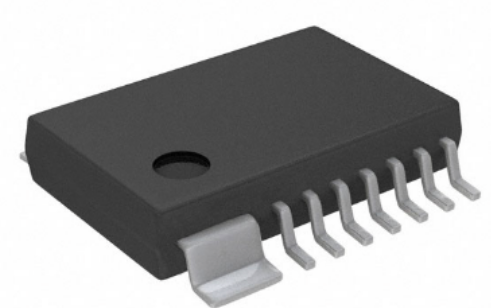
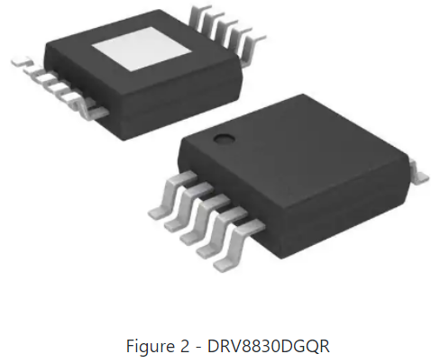
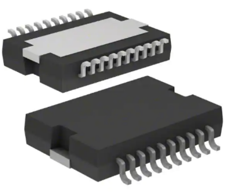
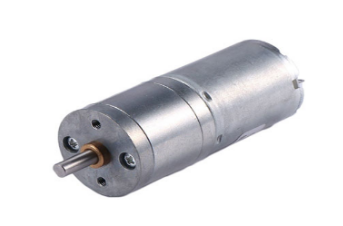

**Component Selection**

Motor Drivers
-

Figure 1 - AM4962GHTR-G1              
**Cost**
* $0.37 each

**Pros**
* 3.5V - 16V

**Cons**
* Only buy in bulk(4000)

Figure 2 - DRV830DGQR
**Cost**
* $2.41 each

**Pros**
* 5V - 20V
* Supports wide variety of motors

**Cons**
* Low output voltage
* Extremely small

Figure 3 - L298P
**Cost**
* $12.75 each

**Pros**
* 4.5V -7V

**Cons**
* Extremely Expensive

Motors
-

Figure 4 - 1597-114090046-ND
**Cost**
* $5.20 each

**Pros**
* Cheap
* Datasheet provided

**Cons**
* Short Axle
* 23 week lead time

Figure 5 - HP25SG-370H-1220-171
**Cost**
* $11.85 each

**Pros**
* Longer axle
* Compact size
* Datasheet provided

**Cons**
* More expensive
* No reviews

Figure 6 - B07D28QKHY
**Cost**
* $12.73 each

**Pros**
* Compact size
* Clear dimensions

**Cons**
* Most expensive option
* No datasheet provided

Temp Sensor
-

Figure 7 - TMP102
**Cost**
* $5.50 each

**Pros**
* Popular and reliable
* High accuracy
* Wide temp range and lower power consumption

**Cons**
* Limited and no built-in resolution
* Not suited for extreme environments
* Not allowed per project guidlines

Figure 8 - TMP1075DR
**Cost**
* $0.76 each

**Pros**
* High accuracy
* Low power consumption
* Wide temp range

**Cons**
* Limited measurement range
* Low resolutionof temp range

Figure 9 - TC74A4-3.3VCTTR
**Cost**
* $1.15 each

**Pros**
* Wide temp range
* Cheap cost
* I2C
* Accuracy

**Cons**
* Resolution
* Calibration

Humidity Sensor
-

Figure 10 - 1528-5183-ND
**Cost**
* $4.50 each

**Pros**
* Fast response
* Wide voltage range

**Cons**
* Lack of robustness
* Temperature dependent

Figure 11 - SHT31-DIS-F2.5kS
**Cost**
* $7.30 each

**Pros**
* Stability
* High accuracy
* Wide operating range

**Cons**
* Expensive cost

Figure 12 - HDC3022
**Cost**
* $3.30 each

**Pros** 
* Low power cobnsumption
* High accuracy
