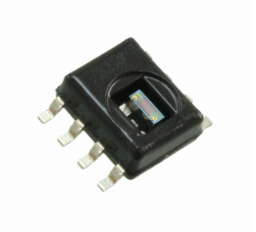
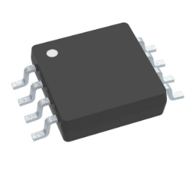

**Componenet Selection**
-
Introduction
-
After coming up with a design that the team agreed upon, we generated a list of components and a proper microcontroller that would fulfill the project requirements and our selected design's functionality. The complete list can be found in [Appendix C](Appendix_C.md)

**Microcontroller Selection**
-
The project guidlines and requirements tasked the team to use a Microchip PIC microcontroller that will be programmed to perform the various functions the device is developed to do. The team selected and compared three different PIC models and determined which would work best for our device. The team decided to settle on the **PIC24FJ64702**.

The **PIC24FJ64702** comes in a 28 pin SOIC package which can be soldered easily and it also contained the appropriate program memory out of the three models that was compared. Having two additional UART and three I2C peripherals, the selected microcontroller can accomodate to all selected environmental sensors and debugging interfaces that would be necessary for a smooth design process.

To find our complete microcontroller selection process, it can be found in [Appendix D](Appendix_D.md)

**Component Selection**
-
Motor Driver
-
**DRV8830DGQR**

**Reasoning**

Following the teams product requirements, we aim to develop a product that can be operated in a safe and low voltage range. With this selected motor driver, we will be able to achieve just that. This selected motor driver controller provides efficient power distribution while also being one of the more cheaper alternatives. 

Motor
-
**JGA25-70 Geared Motor**

**Reasoning**

Team budget and product requirements were taken to consideration when choosing our motor. We wanted to select an effective yet not too expensive motor. So we decided to go with this selected motor that offers high torque and low noise. In order to meet the project requirements, the motor will be used to raise and lower the window shade depending on the states of the sensors that are present in the system. 

Temperature Sensor
-
**CTC74A4-3.3VCTTR**

**Reasoning**

After comparing all other options, this temerature sensor was the least expensive out of all the other temperature sensors. This sensor operates on 3.3V, it is a surface mount component, and uses I2C output. Overall, the temperature sensor that was selected can provide us with the necessary performance and accuracy that is needed to fulfill the project requirements.

Humidity Sensor
-
**HIH6030-021-001**

**Reasoning**

The humidity sensor that we choose ended up being one of our more expensive options. The reason for that is due to the feedback that was provided by the teaching team that our other two selections would not meet the project requirements. However, with the concept of spending a little more than what the team wanted, this sensor still offers the accurate measurments and a wider operating range.

IR Op-Amp
-
**LM358DGKR**

**Reasoning**

The selected IR Sensor Op-Amp that we selected was one of the more cheaper options that offered a wide supply range of 3V to 36V. It also can withstand low to high temperature ranges.

IR Sensor
-
**TMD26721**

**Reasoning**

The IR Sensor that was selected was another one of our susbsytems that met the project goals and guidelines. It allows the system to read in accurate states of light that will be implemented into the system.

3.3 V Regulator
-
**MIC4575WU**

**Reasoning**

With the system being applied with a 6V source, the **MIC4575WU** switching regulator helps balancce the current capability, size, and performance. Although it is another one of our more expensive options, we wanted to ensure that our system is being supplied with the right amount of voltage and current which will also meet the project requirements in the end.

Power Budget
-
To ensure that the entire susbsytem is getting the right amount of power for all subsystems, peripherals, actuators, and sensors, the team put together a power budget table to kind of breakdown our system. To simplify our design, we wanted to maintain a 6V wall mounted main power system and a 3.3V power source for logic. Using the 6V and 3A power source, we would have enough power to power all systems.

<iframe src="vertopal_53e86d8e1b304e0fba1b8ab00a47e725/media/powerbudget.pdf" width="100%" height="500px"></iframe>

[Back to Home](index)
