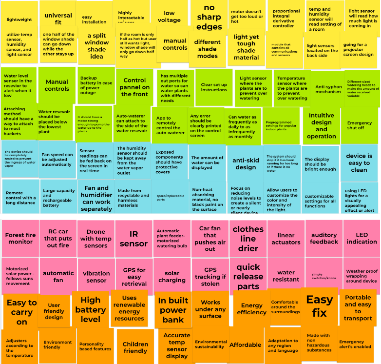

# 3.0 Design Ideation

# 3.1 Brainstorming

Based on the information that we took in from our user needs and product requirements, our team brainstormed a list of ideas of what we want our product to look like and how it will function

# 3.2 Three Designs

Next the team put together three different designs that would meet the project requirements and our project goals. Using inputs from each team member

