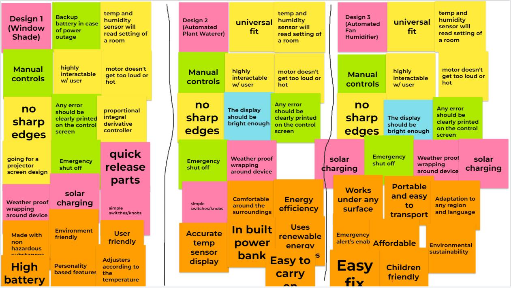
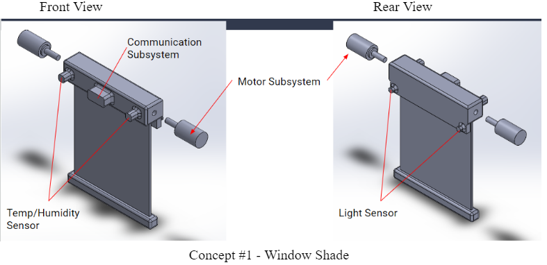
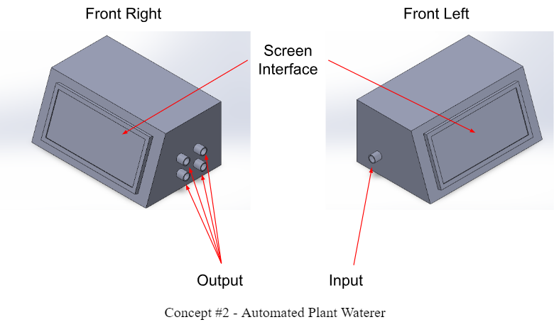
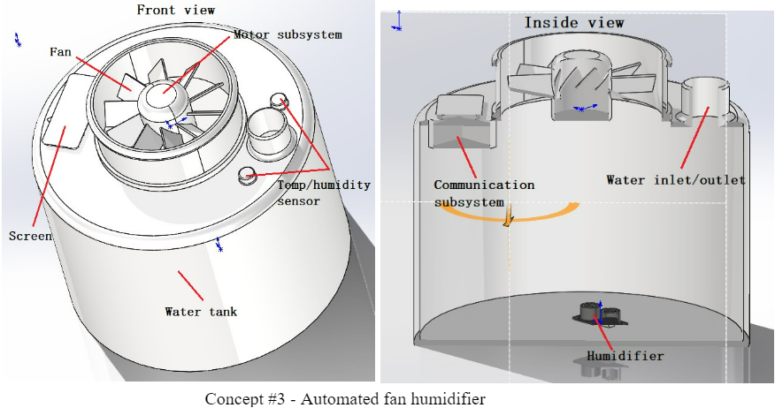

# 3.0 Design Ideation

# 3.1 Brainstorming

Based on the information that we took in from our user needs and product requirements, our team brainstormed a list of ideas of what we want our product to look like and how it will function. The team also decided that our brainstorming process would become more effective as an indivudal process rather than a group process to sort of come up with different ideas on our own. With five members and requiring at least 100 brainstormed ideas as a group, the team successfully came up with 20 ideas on their own and we put them together into three different designs as a whole.

# 3.2 Three Designs

Next the team put together three different designs that would meet the project requirements and our project goals. Using inputs from each team member, we were able to come up with three designs and what we wanted it to look like and how it functioned.

# 3.3 Concepts

Next three group members volunteered to create three concepts sketches

**Concept 1**

Our first concept would be an automated window shade design that would implement a temp sensor, humidity sensor, and light sensor. Essentially the temperature and humidity sensor would read the state of the room that the device is set in and raise and lower the window to either make the room feel a lot more warm or colder depending on what the user prefers. The light sensor would come in to play when the user wants to allow more or less light in the room.

**Concept 2**

For our next concept, it would essentially be an automated plant waterer that would also use the same three environmental sensors to function. The device would read the amount of light, the temperature and humidity of the area is placed in and would input that data into the system which would output a certain amount of water to keep the plants from dying. 

**Concept 3**

And for our last concept, we came up with and automated fan humidifier that would use a temperature and humidity sensor. Essentially, the way this concept was gonna function is that the device would read the setting of the area that is placed in and read the temperature and humidity levels. From there, depending on how high or low the values are, it would then start a humidifier to humidify the area until a comfortable setting has been met.

[Back to Home](index)
