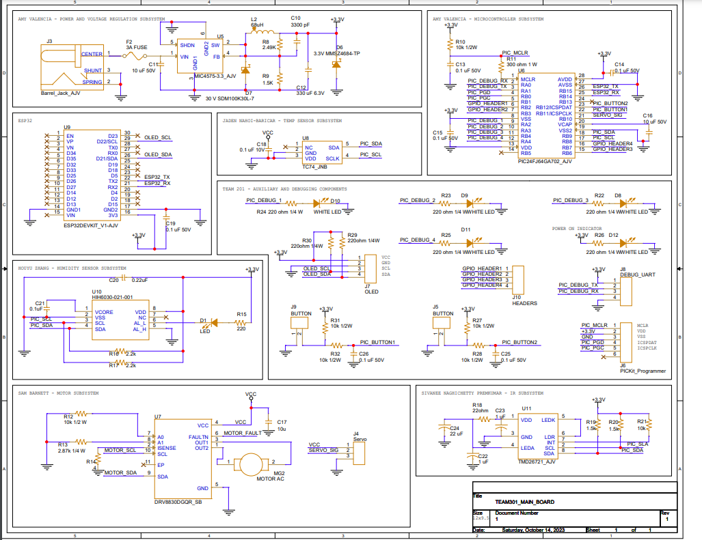

**PCB Functionality**
-
Attached below is the first version of our team board schematic. Noted that there is some room for improvement, we have our schematic showing the temperature, humidity, motor driver, light sensors,  microcontroller, ESP32, power system, and power regulator systems. We also used headers for adjustable connections and verifications.

For our first version of the PCB, on of our main focuses was fitting all components onto the board. And while having a fifth member is good, we needed to incorporate one more subsystem and had to keep that in mind when fitting all subsystems onto one board. We did run into some occasions of posssibly using two boards but we were able to fit everything into one board. 

Connectors
-
The first version of our PCB also contain several connectors that serve for debugging and programming purposes. Essentially, these connectors will be used to make sure that there won't be any signs of shortage, or a component drawing too much current. We wanted to focus on the data that is being sent and received from the I2C and UART ports.

Buttons
-
This version of our PCB contains 4 buttons. Three of them act as interrupts for setting the system into either the off, auto, or timer mode. Our fourth one is for resetting the ESP32.

Sensors
-
The temperature sensor is located in the center. The humidity sensor is located on the lower left hand side. And our IR subsystem is located in the lower right hand side. These three subsystems will control the motor using I2C to actuate the motor to either raise or lower the shade based on the logic it receives. 

Motor Driver
-
Located in the bottom left hand corner is our motor driver susbsystem. This subsystem will be reading the input it receives from all three sensors that were touched on previously. It will communicate through I2C.

Power and Voltage Regulator
-
Our power and voltage regulator subsystem will be located in the top left hand corner. This subsystem is responsible for receiving a wall mounted power supply of 6V and converting that to 3.3V to supply power to our other subsystems.
