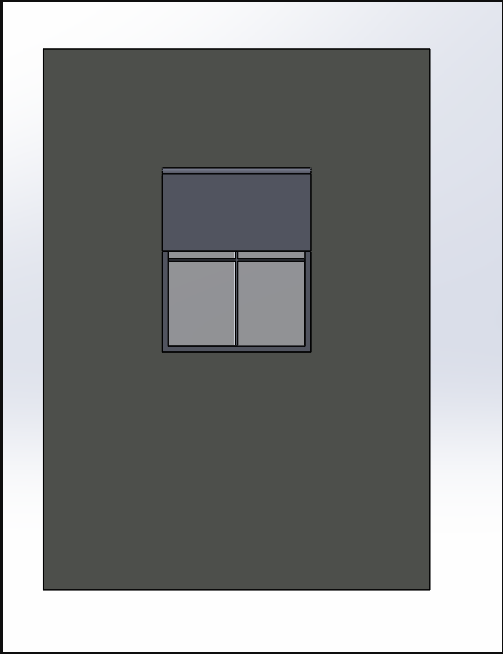
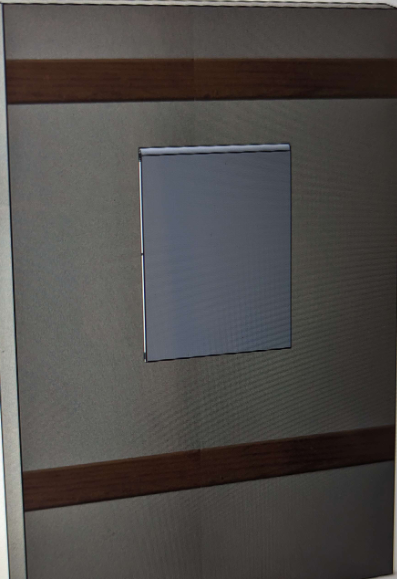

**Selected Design**
-
The team ended up selecting an updated design that would be refined from our first concept, the "Window Shade." This decision was made up due to a few factors. Design 2, our "Automated Plant Waterer" was our runner-up design due to the capability of the idea and how we could also implement a third subsystem to the product which would be the IR Subsystem. Although the concepts and ideas had good intentions, the team felt that there could've been another product that our ideas and knowledge could be put into which would end up being the window shade. Another factor that led us to aboard this idea was due to a number of other groups having the sort of same idea sketch. 

Concept 3 was also abandoned due to not being able to come up with implementing another subsystem for our fifth member. Granted it was a good idea and had good intentions, but the team wanted to apply their focus to an idea that could potentially be not made or thought of. 

Concept 1 was mainly picked due to the possibility that we think we can accomplish with this idea. We could potentially develop an idea that has been in the making but has not been achieved yet. It provided a high level of functionality by allowing a user to interface with the device that would use not two but three environmental sensors to help create a comfortable home atmosphere for them. To add on, we felt that with this concept, the team could meet all of our project goals and requirements. 

**Changes**
-
The changes that were made to the final selected design was the removal of two of our subsystems. Both the humidity and IR sensor subsystems were both cut from the final design of the project due to team dynamics and pink slipping activities. Making this decision did not affect the final design in a positive nor negative way. Some noticable outcomes that came out of this decision was the removal of two interactable features of the product which would allow the user to interact with the window shade device based on the humidity readings and the amount of light entering the room. With the removal of the two subsystems, the team was left with the temperature reading aspect of the design. 

No physical changes were made to the final selected design. All changes that were made to the final product altered the functionality of the device. 

.png)

[Back to Home](index)
