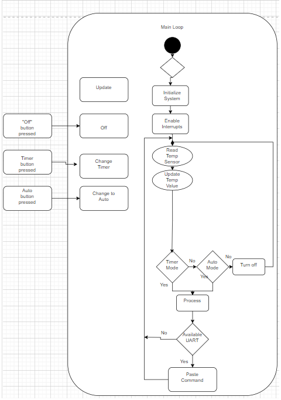
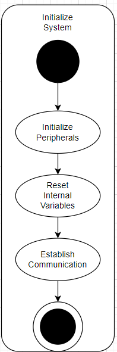
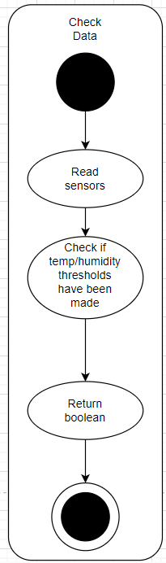
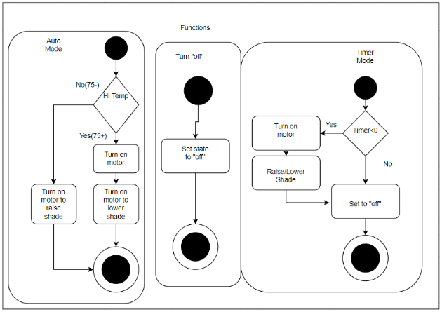
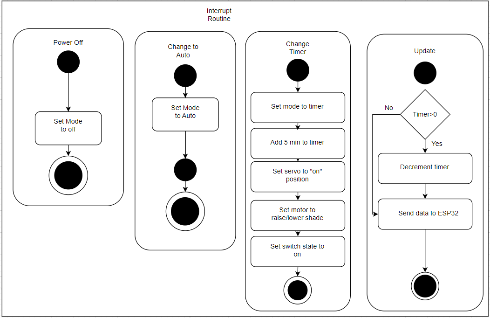
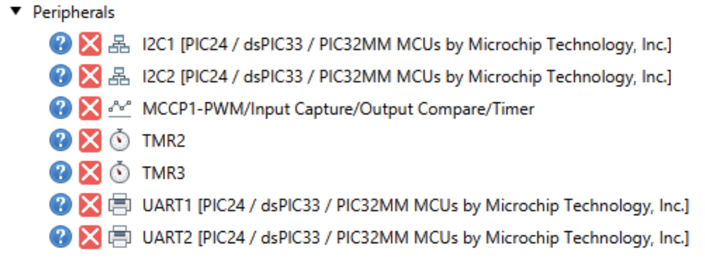
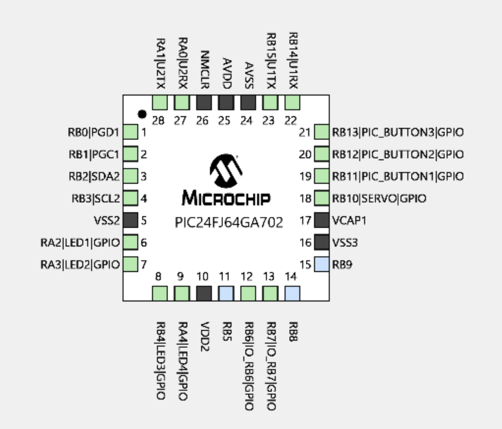
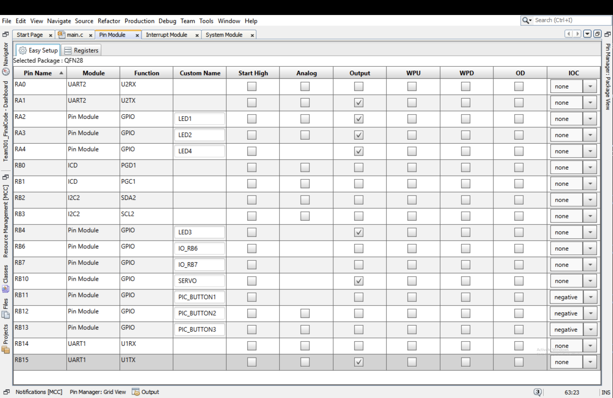

**Software Implementation**
-
Attached below is our final software diagram. Here we can see a breakdown of how our system will function in terms of the main loop, initialization, state functions, and interrupts. 

<iframe src="vertopal_53e86d8e1b304e0fba1b8ab00a47e725/media/Final_Software_Implementation.pdf" width="100%" height="500px"></iframe>

**Software State Flow Function**
-
Here we're going to break down each of the sections starting off with our main loop. Our main loop kind of holds everything together containing readings from all of our sensors and where the logic that is being analyzed from each sensor. After initializing the peripheralas and other variables, it is then transferred into an infinite loop.

In the loop, the three sensors that we choose to implement into our system loop in the following order: temperature, humidity, and light. From here, there is a state machine that will run the processing function for the current mode being used. There will be three system modes: an off, timer, and auto mode. 

Essentially the off mode will keep the system in the off position. The timer mode will leave the shade either up or down depending on the current state it's in. And once the timer reaches 0, the shade will then go in the opposite direction. Auto mode will automatically raise or lower the shade after the readings from the temperature, humidity, and light sensor go through a trial of reading the state of each sensor.

After processing the state functions, the loop will check for new inbound serial data. It can either contain a mode command, to switch to a new mode, or a timer command. Once the process has been completed, the loop starts again.

To help ensure that the system is responding, inputs given by the user are processed with an interrupt service routine that is attached in the main loop startup. When a button is pressed, the interrupt service routines call the necessary logic to change modes. 

Our last interrupt service routine will serve as a countdown to the clock in the timer mode. It sends updates to the ESP32

**MPLabX Peripherals**
The following images show the peripherals and pin GPIO structure utilized in the MPLAB Code Configurator.

Changes to software design
-
1. **Removed Humidity Sensor Subsystem**: The reason why the humidity sensor subsystem was removed from the final software implementation is due to one of the team members dropping the course. With this, the segment of the code that required a humidity sensor component was cut and left the team with more time to focus on coding the rest of the code.

2.  **Removed IR Sensor Subsystem**: The team was not provided with the subsystem in time so the team made the decision to cut the subsystem out of the final design making it the second subsystem that was cut from the final team design. Cutting this subsystem also left the team with more time to spend on coding the overall project.

3.  **Using an unfamiliar PIC**: The PIC24 was packed with more features and the team had a hard time programming the code into the final board. In order to overcome this issue, the team added the generated MCC files into the main code and also implemented printf() statements to help pin-point the location of the error for any possible errors.

4.  **Fixed speed motor**: The team changed this segment of coding to a fixed speed being outputted from the motor. This was done for demonstration purposes because the team could not program the motor to have a changed speed and the only way that we could demonstrate that the motor can actuate is by programming it with a fixed speed.

5.  **Altering the temperature input**: Soley for demonstration purposes was altering the code to turn on a motor when a certain temperature was reached. To tackle this problem, the team altered the code that made the motor actuate without needing a specific temperature value

Version 2.0
-
If the team were to make another version of the software, the first place that we would start at would have to be choosing a PIC microcontroller that we would be familiar with. For starters, we spent a lot of time trying to get ourselves familiar with the PIC microcontroller that we have selected. So instead of trying to get familiar with a microcontroller that contained a lot more features, we would have stuck with a more simplistic microcontroller that we’d be more familiar with. Maybe something that is similar to the microcontroller that we use in the classroom but still meets the project requirements. Another thing that the team would have fixed for another version of the software implementation would have to be picking the components that were used in the class that the team would be familiar with. For instance, the motor driver and temperature sensor were just a few sensors that were used in the classroom for a few assignments. If the team were to go with this route, the team would have more time to spend on a system that we were already familiar with and possibly tweak the code to have more features. To add on to that, with the removal of the humidity and IR sensor subsystems, the team would be in a more comfortable position in terms of team board functionality.  

[Back to Home](index)
